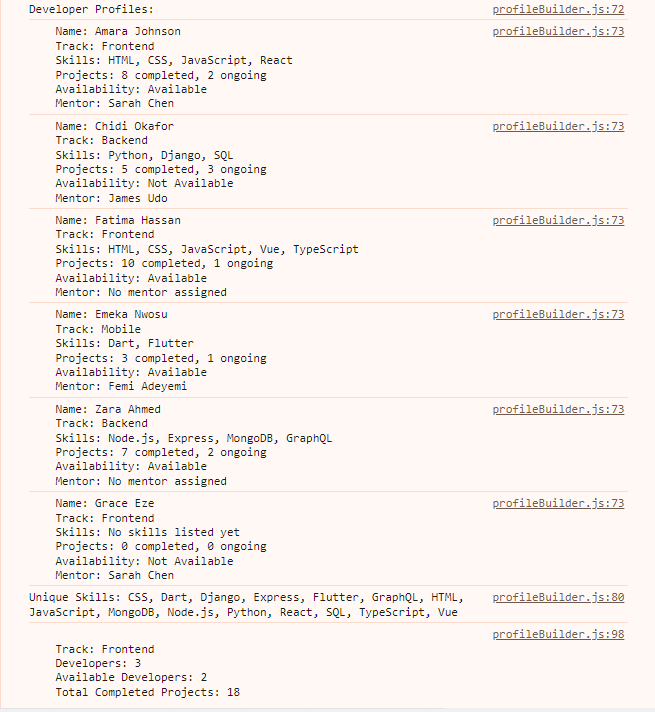
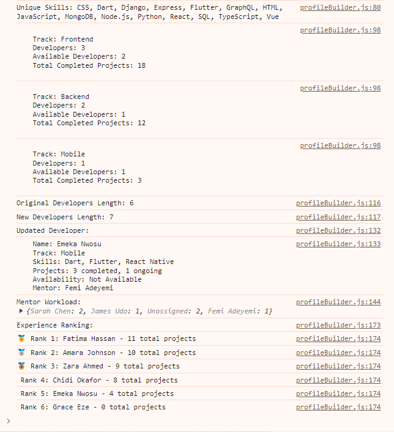

# Profile Builder Project

**Name:** AINA AYOMIDE

**Track:** REACT

## How to run

### `profileBuilder.js`
1. Open a terminal in the project folder:
   ```bash
   cd profile-builder
   ```
2. Run the script with Node.js:
   ```bash
   node profileBuilder.js
   ```
3. Console output will show:
   - developer profiles
   - unique skills
   - track summary
   - updated developer data
   - Mentor Workload
   - Experience Ranking


## Images




